# auralia

A new Flutter project.

## Getting Started

This project is a starting point for a Flutter application.

A few resources to get you started if this is your first Flutter project:

- [Lab: Write your first Flutter app](https://docs.flutter.dev/get-started/codelab)
- [Cookbook: Useful Flutter samples](https://docs.flutter.dev/cookbook)

For help getting started with Flutter development, view the
[online documentation](https://docs.flutter.dev/), which offers tutorials,
samples, guidance on mobile development, and a full API reference.

## Installation

- Follow the setup instruction on the homepage (https://flutter.dev)
- Run `flutter run` in the project root to build the app in debug mode
- Sign in with demo credentials
- Press the button at the bottom of the app and enable everything
- Open spotify and listen to 3 songs (each at list 30s)
- To get an recommendation press the right arrow button
- You will now get an recommendation selected and played

## Issues
- For reasons I was not yet able to indentify I can't use the spotify play method in a background process.
- This requires the current user to always press the right arrow button, at least they get an album containing variable songs 
- It seems like multiple calls 
- Predictions might not scale way in the future (the consine similarity)
- Generall accuray of the model is rather low
- The way of getting spotify tokens is still not great (especially refreshing them)

UML diagram:

History in `/diagrams`
