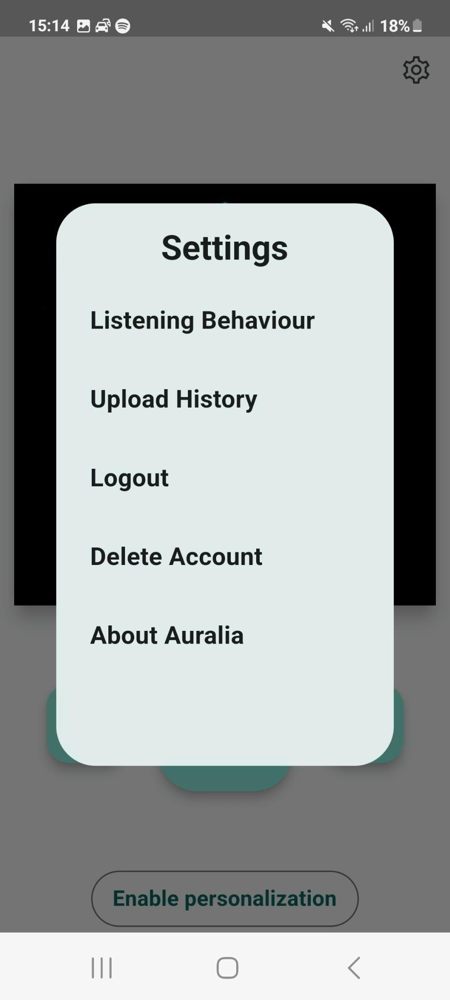

# auralia

The goal of the project is to recommend users music based on their location, current activity (walking,driving etc.) datetime and previous music choices and the Spotify recommendation Api.

For this a ML Model needs to be developed which can handle the predictions and the users music data needs to be send to the server.

## System quality attributes

- simplicity
- modularity
- usability

## Design Patterns

### Creational

- Singleton

### Structural
- Facade
- Composite (Flutter Widget Tree)

### Behaviorial

- Observer (Bloc)
- State (Bloc and Flutter)
- (Chain of Responsibility (backend express middlewre))

## Design Principles
- Encapsulation
- Coding against intefaces
- Parts of SOLID, namly SOID (Single Responsibility, Open Close,Interface Segregation ,Dependenciy Inversion)

## Architecture
Contains parts of:
- Component based (flutter)
- Event driven (flutter)
- "Microservice" (Backend)

## Tooling
- Codemagic to create apk and ipa files automatically and submitt them to the appstores
- dcdg: To create mermaid files for UML
- mmdc: To generate pdf form mermaid files
- Isardb: Database used
- docker: Backend building
- fly.io: Backend hosting
- sentry.io: Error Logging

## Images

 
Home Page with Play, Pause and Skip (+ predict on skip right)

 
Settings Page (everything works except account deletion)

 
User listening history, shows genres, location and similar

## Getting Started

- [Lab: Write your first Flutter app](https://docs.flutter.dev/get-started/codelab)
- [Cookbook: Useful Flutter samples](https://docs.flutter.dev/cookbook)

For help getting started with Flutter development, view the
[online documentation](https://docs.flutter.dev/), which offers tutorials,
samples, guidance on mobile development, and a full API reference.

## Installation

- Follow the setup instruction on the homepage (https://flutter.dev)
- Run `flutter run` in the project root to build the app in debug mode
- Sign in with demo credentials
- Press the button at the bottom of the app and enable everything
- Open spotify and listen to 3 songs (each at list 30s)
- To get an recommendation press the right arrow button
- You will now get an recommendation selected and played

## Features

- Collection of what music the user listens to via Spotify
- Play, pause and replay the last song
- Recommend new music on button press
- View user listening history
- Authenticate users via Spotify OAuth
- Upload users music choices on demand or automatically (depending on Android or IOS)
- Display cover of the currently playing song/soundtrack
- Enable or disable music collection on button press

## Issues
- For reasons I was not yet able to indentify I can't use the spotify play method in a background process.
- This requires the current user to always press the right arrow button, at least they get an album containing variable songs 
- It seems like multiple calls 
- Predictions might not scale way in the future (the consine similarity)
- Generall accuray of the model is rather low
- The way of getting spotify tokens is still not great (especially refreshing them)

### Diagrams:

**App Component Diagram**

### UML Diagrams
History in `/diagrams`
Latest version in easy to read files.

It might be better to download them and view them speratly, as one needs to zoom in a bit due to the size.
**Note:** If Linux default file viewer is used it will only display empty boxes, so if it's viewed on linux open it in a browser.
 
- [First SVG File](./diagrams/output-4-1.svg)
- [Second SVG File](./diagrams/output-4-2.svg)
- [Third SVG File](./diagrams/output-4-3.svg)

### Folder structure
- bloc: Business Logic Components, handle interactions between UI and service
- logic: Contains services and abstractions
- logic/abstract: Interfaces
- logic/spotify-web: Wrapper for Spotifyweb sdk
- logic/util: Utilitiy functions
- logic/webview: Logic related to signing in with webviews
- logic/models: data models
- logic/workerService: background services
- pages: Contains UI for pages
- uiblocks: Ui components